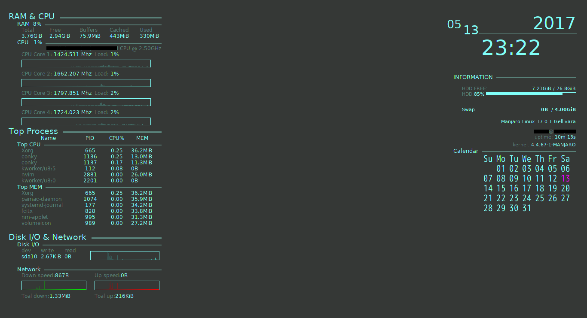

conky-setting
==
Create conky conf that automatically generated according to the environment and run conky script.

* Example desktop image


Setting
--
* Change conf files
	* Set variable `conf_names` like `['info', 'system']` in start.py


Usage
--
* Create and update conky conf.
```sh
python start.py --create
```

* Create conky conf and run conky.
```sh
python start.py --setup
```

* Run conky.
```sh
python start.py --run
```


License
--
Released under the MIT license, see LICENSE.
